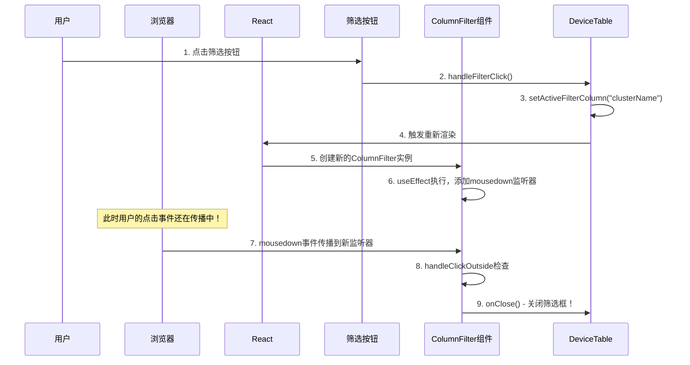

# React 筛选框自动关闭问题深度分析

## 问题核心：事件时序与React渲染机制的冲突

### 1. 问题现象的事件时序图



### 2. 代码级别的详细分析

#### 2.1 原始问题代码

```tsx
// DeviceTable.tsx - 筛选按钮
<Button
  onClick={() => handleFilterClick("clusterName")}
>
  Cluster Name
</Button>

// DeviceTable.tsx - 筛选框
{activeFilterColumn === "clusterName" && (
  <ColumnFilter
    isOpen={true}
    onClose={() => handleFilterClose("clusterName")} // 🚨 每次渲染都是新函数！
    // ... 其他props
  />
)}

// ColumnFilter.tsx - 外部点击监听
useEffect(() => {
  const handleClickOutside = (event: MouseEvent) => {
    if (filterRef.current && !filterRef.current.contains(event.target as Node)) {
      onClose(); // 🚨 立即关闭！
    }
  };

  if (isOpen) {
    document.addEventListener('mousedown', handleClickOutside); // 🚨 立即添加监听器
  }

  return () => {
    document.removeEventListener('mousedown', handleClickOutside);
  };
}, [isOpen, onClose]); // 🚨 onClose每次都变，useEffect每次都执行！
```

#### 2.2 事件执行的微观时序

```javascript
// 时间轴：用户点击筛选按钮的瞬间

// T0: 用户点击筛选按钮
console.log("T0: 用户点击筛选按钮");

// T1: onClick 事件处理器执行
const handleFilterClick = (columnId) => {
  console.log("T1: handleFilterClick 开始执行");
  setActiveFilterColumn(columnId); // 🔥 触发状态更新
  console.log("T1: handleFilterClick 结束，状态已更新");
};

// T2: React 同步渲染阶段
console.log("T2: React 开始同步渲染");
// - DeviceTable 重新渲染
// - 新的 ColumnFilter 组件被创建
// - ColumnFilter 的 useEffect 立即执行

// T3: useEffect 执行（关键时刻！）
useEffect(() => {
  console.log("T3: ColumnFilter useEffect 执行");
  const handleClickOutside = (event) => {
    console.log("T5: handleClickOutside 被调用！事件目标:", event.target);
    // 🚨 这时检查 event.target，发现不在 filterRef 内
    onClose(); // 💥 立即关闭筛选框！
  };
  
  document.addEventListener('mousedown', handleClickOutside);
  console.log("T3: mousedown 监听器已添加");
}, [isOpen, onClose]);

// T4: React 渲染完成，控制权回到浏览器
console.log("T4: React 渲染完成");

// T5: 浏览器继续传播原始的点击事件（关键！）
// 🚨 这个事件就是用户最初点击筛选按钮的那个事件！
// 🚨 但现在 ColumnFilter 的监听器已经存在了，会捕获这个事件
console.log("T5: 浏览器传播 mousedown 事件到新添加的监听器");
```

## 3. 各种解决方案的失败原因

### 3.1 事件阻止冒泡失败的原因

```tsx
// 尝试1: 在选项点击时阻止冒泡
const handleItemToggle = (value: string) => {
  const newValues = localSelectedValues.includes(value) 
    ? localSelectedValues.filter(v => v !== value)
    : [...localSelectedValues, value];
  
  setLocalSelectedValues(newValues);
  onSelectionChange(newValues); // 🔥 这里触发 DeviceTable 重新渲染！
};

<div onClick={(e) => {
  e.stopPropagation(); // ❌ 无效！因为问题不在这个事件
  e.preventDefault();  // ❌ 无效！因为问题不在这个事件
  handleItemToggle(item);
}}>
```

**失败原因：**
- `stopPropagation()` 只能阻止当前事件的传播
- 但问题是：`onSelectionChange` 触发了 React 重新渲染
- 重新渲染创建了新的监听器
- 新监听器捕获的是**用户最初点击筛选按钮的那个事件**，不是当前这个选项点击事件

### 3.2 延迟监听器方案

```tsx
// 尝试2: 延迟添加监听器
useEffect(() => {
  if (!isOpen) return;

  // 🤔 延迟100ms再添加监听器
  const timer = setTimeout(() => {
    const handleClickOutside = (event: MouseEvent) => {
      if (filterRef.current && !filterRef.current.contains(event.target as Node)) {
        onClose();
      }
    };

    document.addEventListener('mousedown', handleClickOutside);
    return () => {
      document.removeEventListener('mousedown', handleClickOutside);
    };
  }, 100);

  return () => {
    clearTimeout(timer);
  };
}, [isOpen, onClose]);
```

**为什么要延迟？**
- 试图让用户的原始点击事件完全传播完毕后，再添加监听器
- 理论上100ms后，用户的点击事件早就处理完了

**为什么仍然失败？**
```javascript
// 延迟监听器的时序问题

// 用户点击筛选按钮
// T0: 用户点击
// T1: handleFilterClick 执行
// T2: setActiveFilterColumn 触发重新渲染  
// T3: ColumnFilter 重新创建，useEffect 执行
// T4: setTimeout 设置100ms延迟
// T5: 原始点击事件传播完成（通常 < 1ms）
// T6: React 渲染完成
// ...
// T100: setTimeout 回调执行，添加监听器

// 看起来没问题，但是...

// 用户点击选项时：
// T200: 用户点击选项
// T201: handleItemToggle 执行
// T202: onSelectionChange 触发重新渲染
// T203: ColumnFilter 再次重新创建！
// T204: useEffect 再次执行，设置新的100ms延迟
// T205: 用户的选项点击事件还在传播
// T305: 新的监听器添加，但用户事件可能已经传播完了

// 问题：延迟时间难以精确控制，在高频操作时仍会有时序问题
```

### 3.3 useCallback 失败的原因

```tsx
// 尝试3: 使用 useCallback 稳定函数引用
const handleFilterClose = useCallback((columnId: string) => {
  setActiveFilterColumn(null);
  setFilterClickStates((prev) => {
    const newMap = new Map(prev);
    newMap.set(columnId, false);
    return newMap;
  });
}, []); // 🤔 依赖项为空，函数引用稳定

// 为每个列创建稳定的 onClose 函数
const clusterNameOnClose = useCallback(() => handleFilterClose("clusterName"), [handleFilterClose]);

// 使用稳定的函数引用
<ColumnFilter
  onClose={clusterNameOnClose} // ✅ 函数引用稳定了
  // ...
/>
```

**为什么部分有效但不能完全解决？**

```tsx
// useCallback 的问题分析

// ✅ 解决了什么：
// - onClose 函数引用稳定，useEffect 不会因为函数变化而重复执行

// ❌ 没解决什么：
useEffect(() => {
  // ...
}, [isOpen, onClose]); 
// 虽然 onClose 稳定了，但 isOpen 从 false -> true 时，useEffect 仍会执行！

// 关键问题：当用户点击筛选按钮时
// 1. isOpen 从 false 变为 true
// 2. useEffect 因为 isOpen 变化而执行
// 3. 立即添加监听器
// 4. 用户的原始点击事件仍在传播
// 5. 新监听器捕获事件并关闭筛选框

// 所以 useCallback 只是减少了重复执行，但没有解决根本的时序问题
```

## 4. 最终解决方案：全局状态管理的深度分析

### 4.1 为什么全局管理能解决问题

```tsx
// 解决方案的核心思想：
// 1. 不在 ColumnFilter 组件内管理外部点击
// 2. 在 DeviceTable 层级统一管理所有筛选框的外部点击
// 3. 避免组件重新挂载时的监听器时序问题

// DeviceTable.tsx - 全局监听器
React.useEffect(() => {
  const handleGlobalClick = (event: MouseEvent) => {
    const target = event.target as Element;
    
    if (!activeFilterColumn) return; // 🔑 没有活跃筛选框时直接返回
    
    // 🔑 关键：精确识别点击区域
    const clickedFilterContainer = target.closest('[data-filter-container]');
    const clickedFilterButton = target.closest('button[data-filter-button]');
    
    if (clickedFilterContainer || clickedFilterButton) {
      return; // 🔑 点击内部或按钮时不关闭
    }
    
    // 🔑 只有点击真正的外部才关闭
    setActiveFilterColumn(null);
    setFilterClickStates(new Map());
  };

  document.addEventListener('mousedown', handleGlobalClick);
  return () => document.removeEventListener('mousedown', handleGlobalClick);
}, [activeFilterColumn]); // 🔑 只依赖 activeFilterColumn
```

### 4.2 全局方案的时序分析

```javascript
// 全局管理的时序图

// === 用户点击筛选按钮 ===
// T0: 用户点击筛选按钮
console.log("T0: 用户点击筛选按钮");

// T1: handleFilterClick 执行
const handleFilterClick = (columnId) => {
  console.log("T1: 设置 activeFilterColumn =", columnId);
  setActiveFilterColumn(columnId); // activeFilterColumn: null -> "clusterName"
};

// T2: React 重新渲染
console.log("T2: React 重新渲染");
// - DeviceTable 重新渲染
// - 全局 useEffect 检测到 activeFilterColumn 变化
// - 全局监听器重新绑定（但监听器逻辑不变）
// - ColumnFilter 被创建（但没有自己的外部点击监听器！）

// T3: 浏览器传播原始点击事件
// 全局监听器接收到事件
const handleGlobalClick = (event) => {
  console.log("T3: 全局监听器接收事件，目标:", event.target);
  
  // 检查是否点击了筛选按钮
  const clickedFilterButton = event.target.closest('button[data-filter-button]');
  if (clickedFilterButton) {
    console.log("T3: 检测到点击筛选按钮，不关闭筛选框");
    return; // ✅ 不关闭！
  }
  
  // 如果是其他地方，才关闭
  console.log("T3: 点击外部，关闭筛选框");
  setActiveFilterColumn(null);
};

// === 用户点击筛选框选项 ===
// T10: 用户点击选项
console.log("T10: 用户点击筛选框选项");

// T11: handleItemToggle 执行
const handleItemToggle = (value) => {
  console.log("T11: 处理选项切换");
  onSelectionChange(newValues); // 触发 DeviceTable 重新渲染
};

// T12: React 重新渲染
console.log("T12: React 重新渲染（因为 columnFilters 变化）");
// - DeviceTable 重新渲染
// - ColumnFilter 重新创建
// - 但全局监听器还是同一个！activeFilterColumn 没变

// T13: 浏览器传播选项点击事件
const handleGlobalClick = (event) => {
  console.log("T13: 全局监听器接收选项点击事件");
  
  // 检查是否点击了筛选框内部
  const clickedFilterContainer = event.target.closest('[data-filter-container]');
  if (clickedFilterContainer) {
    console.log("T13: 检测到点击筛选框内部，不关闭");
    return; // ✅ 不关闭！
  }
};
```

### 4.3 关键技术细节

#### 4.3.1 Element.closest() 的精确匹配

```tsx
// 标记筛选按钮
<Button
  data-filter-button="clusterName" // 🔑 标记按钮
  onClick={() => handleFilterClick("clusterName")}
>
  Cluster Name
</Button>

// 标记筛选框容器
<div 
  data-filter-container="true" // 🔑 标记容器
  className="absolute z-50 bg-white..."
>
  {/* 筛选框内容 */}
</div>

// 精确检测点击区域
const handleGlobalClick = (event: MouseEvent) => {
  const target = event.target as Element;
  
  // 🔑 向上查找，看是否点击了按钮或容器
  const clickedButton = target.closest('button[data-filter-button]');
  const clickedContainer = target.closest('[data-filter-container]');
  
  // 🔑 只有都不是，才认为是外部点击
  if (!clickedButton && !clickedContainer) {
    setActiveFilterColumn(null); // 关闭筛选框
  }
};
```

#### 4.3.2 监听器生命周期管理

```tsx
// 全局监听器的依赖项设计
React.useEffect(() => {
  const handleGlobalClick = (event: MouseEvent) => {
    // 监听器逻辑
  };

  document.addEventListener('mousedown', handleGlobalClick);
  return () => document.removeEventListener('mousedown', handleGlobalClick);
}, [activeFilterColumn]); // 🔑 只依赖 activeFilterColumn

// 为什么这样设计依赖项？
// 1. activeFilterColumn 变化时，监听器需要重新绑定
// 2. 但监听器的逻辑不会因为其他状态变化而重新创建
// 3. 避免了频繁的监听器添加/移除
```

## 5. 方案对比总结

| 方案 | 解决思路 | 失败原因 | 代码示例 |
|------|----------|----------|----------|
| **事件阻止冒泡** | 阻止事件传播 | 问题不在当前事件，而在组件重新挂载 | `e.stopPropagation()` |
| **延迟监听器** | 延迟添加监听器 | 延迟时间难以精确控制，高频操作仍有问题 | `setTimeout(() => addEventListener(), 100)` |
| **useCallback** | 稳定函数引用 | 只解决了函数引用问题，没解决 isOpen 变化导致的重新执行 | `useCallback(() => {}, [])` |
| **全局状态管理** | 统一管理，避免组件级监听器 | ✅ 完美解决 | 在父组件统一管理所有外部点击 |

## 6. 实际代码实现

### 6.1 DeviceTable.tsx 关键修改

```tsx
export default function DeviceTable() {
  // ... 其他状态

  // 全局点击处理器 - 在DeviceTable级别管理筛选框关闭
  React.useEffect(() => {
    const handleGlobalClick = (event: MouseEvent) => {
      const target = event.target as Element;
      
      // 如果没有活跃的筛选框，不处理
      if (!activeFilterColumn) return;
      
      // 检查是否点击了筛选框内部或筛选按钮
      const clickedFilterContainer = target.closest('[data-filter-container]');
      const clickedFilterButton = target.closest('button[data-filter-button]');
      
      // 如果点击的是筛选框内部或筛选按钮，不关闭
      if (clickedFilterContainer || clickedFilterButton) {
        return;
      }
      
      // 其他情况关闭筛选框
      setActiveFilterColumn(null);
      setFilterClickStates(new Map());
    };

    document.addEventListener('mousedown', handleGlobalClick);
    return () => document.removeEventListener('mousedown', handleGlobalClick);
  }, [activeFilterColumn]);

  // 筛选按钮添加标识
  <Button
    data-filter-button="clusterName"
    variant="ghost"
    onClick={() => handleFilterClick("clusterName")}
  >
    Cluster Name
  </Button>

  // ... 其他代码
}
```

### 6.2 ColumnFilter.tsx 关键修改

```tsx
export default function ColumnFilter({ ... }) {
  // 移除原有的外部点击监听器
  // useEffect(() => {
  //   const handleClickOutside = (event: MouseEvent) => {
  //     if (filterRef.current && !filterRef.current.contains(event.target as Node)) {
  //       onClose();
  //     }
  //   };
  //   // ...
  // }, [isOpen, onClose]);

  return (
    <div 
      ref={filterRef}
      data-filter-container="true" // 🔑 添加容器标识
      className="absolute z-50 bg-white border border-gray-300 rounded-lg shadow-lg max-w-[160px]"
    >
      {/* 筛选框内容 */}
    </div>
  );
}
```

## 7. 核心洞察

1. **React 的渲染是同步的**：状态更新立即触发重新渲染
2. **浏览器事件是异步的**：点击事件的传播可能发生在渲染之后
3. **useEffect 的执行时机**：在渲染完成后立即执行，可能仍在事件传播期间
4. **组件重新挂载**：会重新创建所有副作用，包括事件监听器
5. **状态管理层级**：在合适的层级管理状态，避免不必要的重新创建

## 8. 经验总结

这个问题的核心是：**React 的渲染机制与浏览器的事件传播机制之间的时序竞争**。解决方案是通过**架构设计**避免这种竞争，而不是试图在时序上"打补丁"。

### 关键教训：

1. **避免在易重新挂载的组件中管理全局副作用**
2. **使用 data 属性进行精确的 DOM 查询**
3. **Element.closest() 是处理复杂 DOM 结构的利器**
4. **状态管理要考虑组件的生命周期**
5. **性能问题往往源于架构设计，而非代码优化**

### 适用场景：

- 任何需要处理外部点击的下拉菜单、弹窗组件
- 复杂的表格交互功能
- 多层嵌套的 UI 组件交互
- 需要精确控制事件处理时机的场景

这个解决方案不仅解决了当前问题，也为类似的 React 事件处理问题提供了可复用的架构模式。